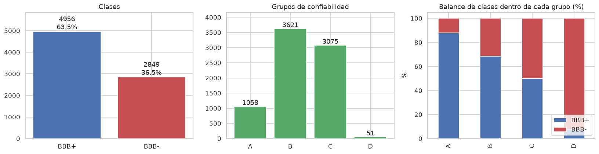
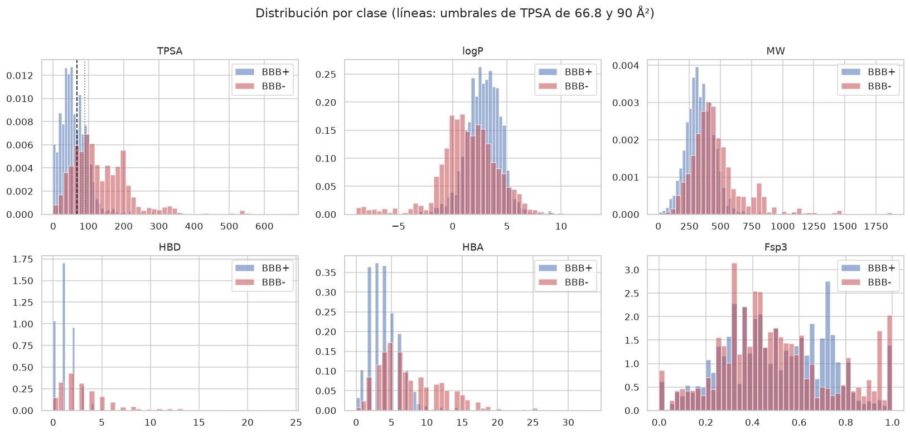
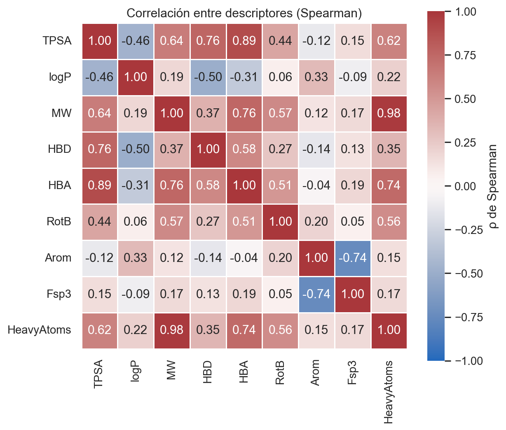
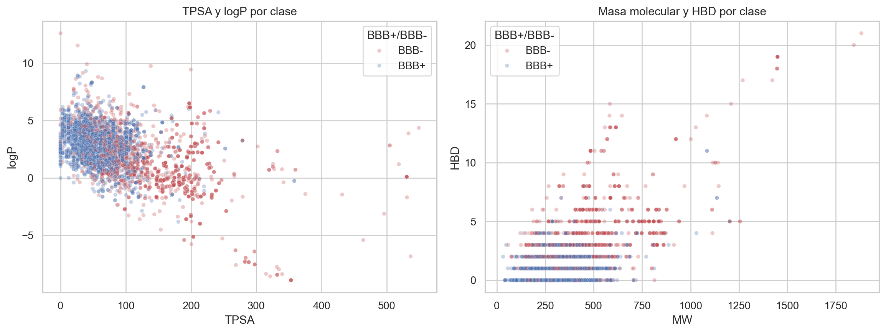
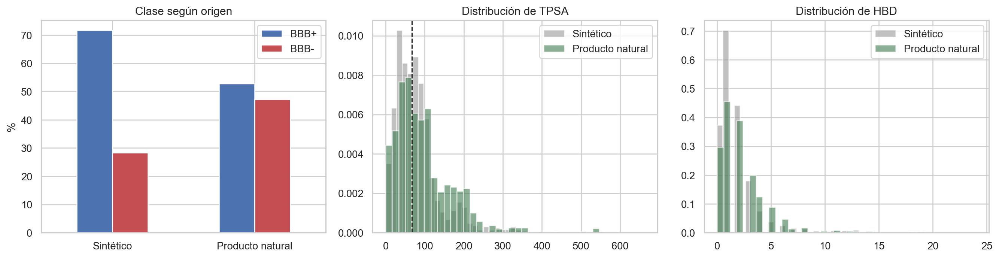
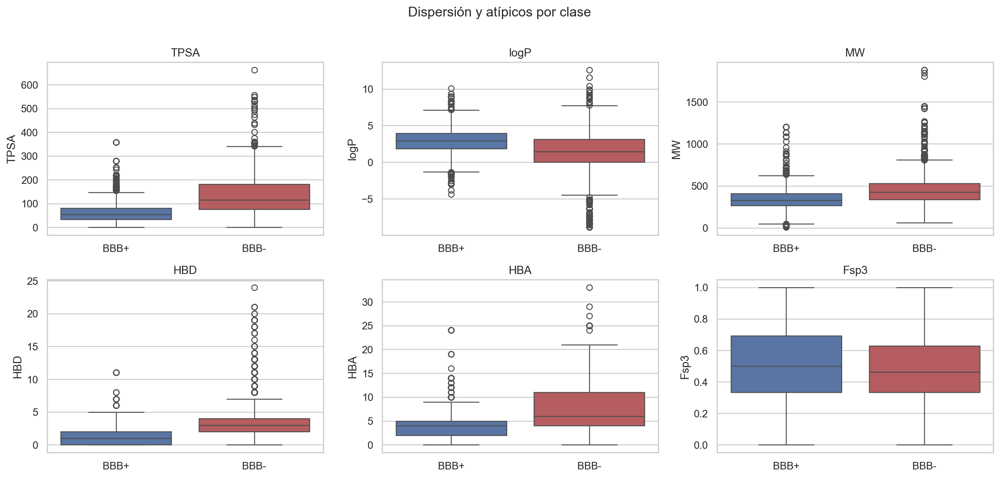

```{=typst}
#set text(hyphenate: false)
#show table: set par(justify: false)
#show bibliography: set par(justify: false)

// ---------------------------------------------------------------- PORTADA
#place(bottom + center, dy: -0.5cm)[
  #text(size: 10.5pt)[4 de octubre de 2026]
]

#align(center)[
  #set par(justify: false)
  #v(0.6cm)
  #text(size: 13pt, weight: "bold")[Tecnológico de Monterrey]

  #v(0.15cm)
  #text(size: 11pt)[Escuela de Ingeniería y Ciencias]

  #v(0.15cm)
  #text(size: 11pt)[Maestría en Inteligencia Artificial Aplicada]

  #v(0.4cm)
  #text(size: 10.5pt, style: "italic")[Proyecto Integrador · TC5035.10]

  #v(1.3cm)
  #text(size: 12pt, weight: "bold")[Avance 1. Análisis exploratorio de datos]

  #v(0.9cm)
  #line(length: 78%, stroke: 0.6pt)
  #v(0.7cm)

  #text(size: 22pt, weight: "bold")[Bioactive AI]

  #v(0.5cm)
  #block(width: 85%)[
    #text(size: 12.5pt)[
      Predicción y priorización de compuestos bioactivos con
      potencial neuroprotector a partir de su estructura molecular
    ]
  ]

  #v(0.7cm)
  #line(length: 78%, stroke: 0.6pt)

  #v(1.3cm)
  #text(size: 11pt, weight: "bold")[Profesora]

  #v(0.2cm)
  #text(size: 11pt)[Dra. Mariana Martínez Ávila]

  #v(1.1cm)
  #text(size: 11pt, weight: "bold")[Equipo 7]

  #v(0.35cm)
  #table(
    columns: (auto, auto),
    stroke: none,
    align: (right, left),
    inset: (x: 0.6em, y: 0.35em),
    [Ingrid Pamela Ruiz Puga], [A01021209],
    [Artemio Santiago Padilla Robles], [A01796613],
    [José Antonio Vázquez Martínez], [A01797208],
  )

]

#pagebreak()

// ---------------------------------------------------------------- ÍNDICE
#outline(title: [Índice], depth: 2, indent: auto)

#pagebreak()
```

# Introducción

La barrera hematoencefálica (BBB, por sus siglas en inglés) regula el paso de sustancias entre la sangre y el encéfalo. Su permeabilidad es relevante para priorizar candidatos neuroprotectores: una molécula que no alcanza el sistema nervioso central (SNC)[^snc] difícilmente ejercerá allí un efecto directo. Sin embargo, una etiqueta BBB− no debe usarse como filtro absoluto del proyecto; la predicción de permeabilidad y la predicción de actividad biológica son evidencias complementarias, no un descarte automático.

El objetivo general es estudiar compuestos bioactivos, incluidos productos naturales. Un producto natural es una sustancia producida por un organismo; molécula o compuesto designa la entidad química definida por sus átomos y enlaces. Una colección como COCONUT organiza estructuras conocidas de productos naturales. En cambio, un registro de actividad experimental describe el resultado de un ensayo y relaciona un compuesto con un sistema biológico, una medida y unas condiciones. Una estructura puede aparecer en muchos registros: contar ensayos no equivale a contar compuestos únicos. Este avance se limita a la permeabilidad BBB; el análisis de actividad neuroprotectora corresponde a otra etapa del proyecto.

La glicoproteína-P puede expulsar ciertas sustancias desde las células endoteliales de la barrera hacia la sangre mediante eflujo activo,[^eflujo] lo que ayuda a entender por qué las propiedades fisicoquímicas no determinan por sí solas la concentración cerebral. Por tanto, los resultados de este EDA describen asociaciones del conjunto y no garantizan exposición cerebral ni eficacia terapéutica.

[^snc]: **SNC:** sistema nervioso central, formado principalmente por el encéfalo y la médula espinal.
[^eflujo]: **Eflujo activo mediado por glicoproteína-P:** transporte que utiliza energía para devolver ciertos compuestos desde las células endoteliales de la barrera hematoencefálica hacia la sangre; puede reducir su acumulación en el cerebro.

# Alcance de este reporte

El entregable formal de este avance, según las especificaciones de la actividad, es la liga al notebook ejecutado de principio a fin: [`notebooks/01_EDA.ipynb`](../../../notebooks/01_EDA.ipynb). Este documento es un acompañante en el mismo formato de reporte que el Avance 0: recoge los hallazgos del notebook organizados según los criterios de la rúbrica, con las cifras tomadas directamente de su ejecución, no recalculadas aparte.

**La fuente primaria es el conjunto curado por la patrocinadora**, [`bbb_permeability_experimental.csv`](../../../data/external/profesora/bbb_permeability_experimental.csv), entregado el 25 de septiembre junto con el [diccionario de permeabilidad BBB](../../../data/external/profesora/DICCIONARIO_permeabilidad_bbb.pdf). Deriva de B3DB [@meng2021b3db] pero viene procesado: SMILES estandarizados con RDKit, esqueleto de conectividad precalculado y, sobre todo, **cruzado estructuralmente con COCONUT** [@chandrasekhar2025coconut], el catálogo abierto de productos naturales.

Los archivos de B3DB que el equipo descargó por su cuenta se conservan como **verificación complementaria**: permiten contrastar conteos y confirmar de forma independiente los problemas de calidad, pero no son la base del análisis.

Esa elección no es solo de procedencia. El cruce con COCONUT habilita la pregunta central del proyecto —si los productos naturales, que son los compuestos a priorizar, se comportan distinto frente a la barrera— y es la que produce el hallazgo de la sección correspondiente.

El EDA del conjunto de actividad en SNC (etapa 2) queda pendiente para un avance posterior.

# Estructura de los datos

El archivo de la patrocinadora tiene **7,811 filas y 16 columnas**, un compuesto por fila, integrando información de clasificación y regresión de B3DB. De ellas, **7,805 tienen clase asignada** y constituyen el conjunto de trabajo para los análisis de clasificación. Las otras seis contienen un valor de `logbb`, pero no una clase BBB en el archivo integrado. El diccionario de la patrocinadora indica que sí tienen clase en B3DB, pero que la fila de clasificación corresponde a otra forma estereoquímica y no coincidió durante la unión por estructura. Se conservan en el archivo fuente y se excluyen de los análisis que requieren la etiqueta BBB integrada; no se les asigna una etiqueta a partir de la conectividad, porque la estereoquímica puede afectar la clasificación. El conjunto de trabajo contiene 1,052 valores de `logbb`.

El esquema contiene 13 columnas de texto (estructura, identificadores, clase, grupo y referencias), dos columnas numéricas de punto flotante (`logbb` y `b3db_threshold`) y un conteo entero (`coconut_matches_key14`). `logbb` es una medida continua disponible solo para parte de los registros; `b3db_threshold` almacena un umbral numérico que, en esta muestra, siempre vale −1 cuando está presente y por tanto no presenta variación. La tabla siguiente resume las tres variables numéricas originales sobre las 7,805 filas etiquetadas; el número de observaciones válidas se indica por separado para no ocultar los faltantes.

| Variable | n válido | Media | DE | Mediana | Mín.–máx. |
|:---------|---------:|------:|---:|--------:|:---------|
| `logbb` | 1,052 | −0.08 | 0.75 | −0.01 | [−2.69, 1.70] |
| `b3db_threshold` | 3,621 | −1.00 | 0.00 | −1.00 | [−1.00, −1.00] |
| `coconut_matches_key14` | 7,805 | 1.70 | 3.23 | 1 | [0, 66] |

: Estadísticas descriptivas de las variables numéricas originales en el conjunto etiquetado (n=7,805); DE: desviación estándar {#tbl-numericas-originales tbl-colwidths="[27,14,14,12,15,18]"}

Los descriptores fisicoquímicos —`TPSA` (área de superficie polar topológica, en Ų), `logP` (coeficiente de partición octanol-agua, mide lipofilicidad), `MW` (peso molecular), entre otros— se calculan a partir del SMILES[^smiles] en la sección de Análisis univariante; no forman parte de las columnas originales.

[^smiles]: Representación textual de una molécula como cadena de caracteres, sin necesidad de dibujarla; por ejemplo, `CCO` representa el etanol —dos carbonos encadenados y un oxígeno—.

## Variable objetivo y variables de agrupamiento

| Variable | Valores | Frecuencia |
|:---------|:--------|:-----------|
| `BBB+/BBB-` (clase) | BBB+ / BBB− | 4,956 (63.5%) / 2,849 (36.5%) — razón 1.74:1 |
| `group` (clasificación B3DB) | A / B / C / D | 1,058 / 3,621 / 3,075 / 51 |
| `b3db_uncertainty_regression` | A / B / C / D / faltante | 241 / 659 / 3 / 149 / 6,753 |

: Frecuencia de variables categóricas de baja cardinalidad, conjunto etiquetado (n=7,805) {#tbl-frecuencias tbl-colwidths="[36,27,37]"}

La categoría de incertidumbre de regresión está disponible en las 1,052 filas etiquetadas con `logbb`; sus 6,753 faltantes corresponden a registros sin esa medición. Los campos restantes de texto con muchos valores distintos —por ejemplo, nombres, identificadores de estructura y referencias— se tratan como identificadores o metadatos de procedencia, no como categorías predictoras ordinarias.

B3DB indica que sus categorías agrupan registros según la incertidumbre de las mediciones, pero **no publica el criterio completo de asignación**; el diccionario de la patrocinadora advierte que filtrar “solo A” no tiene respaldo documentado. En la muestra etiquetada, A reúne 1,058 filas (1,052 con `logbb` y 6 sin ese valor); B reúne 3,621 filas, todas con `b3db_threshold` = −1; C comprende 3,075 filas sin `logbb` ni umbral y con mediana de una referencia; D comprende 51 filas con esas mismas ausencias y mediana de tres referencias. Estos son patrones observados, no una escala ordinal de calidad ni una justificación suficiente para excluir registros.

Las seis filas sin clase integrada también tienen `logbb` y no tienen categoría de clasificación `group`; por eso no se incluyen en las frecuencias anteriores. El grupo está asociado con la distribución de clases y no debe interpretarse como orden de calidad. Se conserva para describir y estratificar los análisis, no como regla automática para excluir observaciones.

{#fig-clases width=100%}

## Valores faltantes por columna

De las 16 columnas, 8 tienen huecos:

| Columna | Faltantes | % |
|:--------|----------:|--:|
| `logbb` | 6,753 | 86.5 |
| `b3db_uncertainty_regression` | 6,753 | 86.5 |
| `b3db_reference_regression` | 6,753 | 86.5 |
| `source_id_regression` | 6,753 | 86.5 |
| `coconut_id_exact_match` | 4,439 | 56.9 |
| `b3db_threshold` | 4,184 | 53.6 |
| `coconut_ids_key14_match` | 3,436 | 44.0 |
| `compound_name` | 1,109 | 14.2 |

: Valores faltantes por columna, conjunto de trabajo (n=7,805) {#tbl-faltantes tbl-colwidths="[42,29,29]"}

Los faltantes de las cuatro columnas del lado de **regresión** (6,753; 86.5%) coinciden con las 6,753 filas sin `logbb` entre las 7,805 etiquetadas. En el archivo completo hay 1,058 valores de `logbb`, pero seis corresponden a filas cuya clase de B3DB no se integró por la diferencia estereoquímica documentada por la patrocinadora; por eso aquí se cuentan 1,052. `b3db_threshold` falta en A, C y D; todos los valores presentes (3,621) corresponden a B y son −1. Los campos de COCONUT faltan cuando no hay coincidencia estructural para el tipo de cruce correspondiente. `compound_name` es un metadato descriptivo que no se usa para modelar.

Las columnas que sí importan para el modelo —`smiles_std`, `bbb_class`, `inchikey`, `key14` y `b3db_uncertainty_classification`— **no tienen ningún faltante**.

## El tamaño efectivo es menor que el número de filas

Al recalcular el InChIKey[^inchikey] desde el SMILES con RDKit quedan **3 filas redundantes por InChIKey completo**: una asociada a ampicilina/sultamicilina tras la estandarización estructural y dos registros repetidos de otros compuestos. Las etiquetas coinciden en cada estructura duplicada, así que no introducen conflicto.

El problema real está un nivel más abajo: **3,787 duplicados por esqueleto de conectividad** (los primeros 14 caracteres del InChIKey, que ignoran estereoquímica). El conjunto tiene **4,018 esqueletos únicos en 7,805 filas**: una molécula como el ácido fusídico aparece nueve veces, como estereoisómeros[^estereoisomero] o con nombres distintos. **131 esqueletos (429 compuestos, 5.5%) tienen etiquetas BBB+/BBB− contradictorias entre sus propios estereoisómeros.**

[^inchikey]: Identificador químico estándar derivado de la estructura molecular; a diferencia del SMILES, la misma molécula siempre produce el mismo InChIKey sin importar qué herramienta lo calcule.
[^estereoisomero]: Molécula con la misma fórmula y conectividad de átomos que otra, pero con distinta disposición espacial (por ejemplo, distinta quiralidad); dos estereoisómeros del mismo compuesto pueden tener actividad biológica distinta.

**Consecuencia directa:** reportar "7,805 compuestos" sin más sobreestima la información independiente por un factor cercano a dos, y un split aleatorio pondría estereoisómeros del mismo compuesto en entrenamiento y en prueba.

# Análisis univariante

Se calcularon 9 descriptores fisicoquímicos por compuesto con RDKit: `TPSA`, `logP` y `MW` (glosados arriba), `HBD` (donadores de puente de hidrógeno), `HBA` (aceptores de puente de hidrógeno), `RotB` (enlaces rotables), `Arom` (anillos aromáticos), `Fsp3` (fracción de carbonos con hibridación sp³) y `HeavyAtoms` (átomos distintos de hidrógeno).

| Descriptor | Media BBB+ | Media BBB− | Mediana BBB+ | Mediana BBB− | DE BBB+ | DE BBB− |
|:-----------|-----------:|-----------:|--------------:|---------------:|---------:|---------:|
| TPSA | 60.02 | 133.74 | 53.85 | 114.99 | 37.50 | 81.44 |
| logP | 2.87 | 1.45 | 2.92 | 1.46 | 1.58 | 2.75 |
| MW | 339.85 | 464.22 | 330.48 | 424.53 | 121.13 | 210.08 |
| HBD | 1.23 | 3.37 | 1.00 | 3.00 | 1.09 | 3.01 |
| HBA | 3.97 | 7.59 | 4.00 | 6.00 | 2.21 | 4.46 |
| RotB | 3.92 | 6.25 | 4.00 | 6.00 | 2.82 | 4.35 |
| Arom | 1.27 | 1.40 | 1.00 | 1.00 | 1.03 | 1.16 |
| Fsp3 | 0.50 | 0.50 | 0.50 | 0.46 | 0.22 | 0.24 |
| HeavyAtoms | 23.91 | 32.07 | 23.00 | 29.00 | 8.54 | 14.96 |

: Estadísticas descriptivas de los 9 descriptores, por clase {#tbl-describe tbl-colwidths="[18,12,12,15,15,13,13]"}

{#fig-descriptores width=100%}

Las distribuciones de TPSA, HBD y HBA se separan visiblemente entre BBB+ y BBB−; `Fsp3` y `Arom` casi no lo hacen, lo cual se confirma cuantitativamente en la sección siguiente.

# Análisis bi/multivariante

## Poder discriminante individual contra la etiqueta

El **AUC** (área bajo la curva ROC) mide qué tan bien un solo descriptor separa las dos clases por sí mismo, sin necesidad de un modelo: 0.5 equivale a adivinar al azar y 1.0 a una separación perfecta.

| Descriptor | AUC (A+B, n=4,679) | AUC (completo, n=7,805) | AUC publicado (n=1,058) |
|:-----------|--------------------:|-------------------------:|--------------------------:|
| TPSA | 0.850 | 0.813 | 0.746 |
| HBD | 0.811 | 0.777 | 0.699 |
| HBA | 0.803 | 0.763 | 0.673 |
| MW | 0.729 | 0.703 | 0.583 |
| logP | 0.728 | 0.681 | 0.617 |
| HeavyAtoms | 0.709 | 0.683 | — |
| RotB | 0.683 | 0.695 | — |
| Arom | 0.501 | 0.525 | — |
| Fsp3 | 0.501 | 0.516 | — |

: Área bajo la curva ROC de cada descriptor contra la clase BBB+/BBB−, calculada sobre los datos, contra la cifra publicada sobre el subconjunto con logBB [@tiwari2026umbrales] {#tbl-auc tbl-colwidths="[22,26,26,26]"}

## Correlación entre descriptores

El orden de la tabla anterior no implica que TPSA, HBD, HBA, MW y HeavyAtoms aporten cinco señales independientes. La @fig-correlacion muestra la correlación de Spearman entre los 9 descriptores —se usa Spearman, no Pearson, porque varios son conteos enteros de distribución sesgada—.

{#fig-correlacion width=85%}

Dos pares destacan:

- **MW y HeavyAtoms: ρ = 0.98.** Son casi la misma variable medida dos veces, lo que explica que tengan un poder discriminante casi idéntico en la @tbl-auc: no son dos señales independientes, sino una sola vista desde dos ángulos.
- **TPSA con HBA (ρ = 0.89) y con HBD (ρ = 0.76).** El TPSA se calcula de forma aditiva sobre los mismos átomos polares que definen a los donadores y aceptores de puente de hidrógeno. Que los tres encabecen la @tbl-auc no son tres hallazgos independientes: es un solo eje de polaridad medido de tres formas distintas.
- Adicionalmente, **Arom y Fsp3: ρ = −0.74**, con sentido químico directo: más anillos aromáticos implica una molécula más plana, con menos carbonos de hibridación sp³.

**Consecuencia para el Avance 2.** Al construir la matriz de características no conviene tratar estos descriptores como señales independientes; un método de selección debería descartar la redundancia entre MW y HeavyAtoms antes de entrenar, en vez de dejar que el modelo la absorba sin control.

## Relaciones bivariantes entre descriptores y clase

La matriz de Spearman cuantifica la asociación entre pares de descriptores, pero no muestra por sí sola cómo se distribuyen conjuntamente las observaciones frente a la etiqueta. El gráfico @fig-relaciones complementa ese resumen con TPSA frente a logP y MW frente a HBD, coloreados por clase BBB. Para mantener legible la nube se representa una muestra aleatoria reproducible de hasta 4,000 observaciones; las estadísticas y correlaciones del notebook se calculan sobre el conjunto de trabajo completo. Las clases se solapan en ambos planos, aunque BBB+ tiende a concentrarse en valores menores de TPSA, MW y HBD. Estos patrones son descriptivos y no establecen causalidad ni un límite de decisión validado.

{#fig-relaciones width=100%}

## Productos naturales contra sintéticos

El cruce con COCONUT que trae el conjunto de la patrocinadora permite separar los compuestos de origen natural de los sintéticos. Es la pregunta central del proyecto: los compuestos que se quieren priorizar son productos naturales.

| Grupo | n | % BBB+ | % BBB− |
|:------|--:|-------:|-------:|
| Sintético (sin equivalente natural conocido) | 4,439 | 71.7 | 28.3 |
| **Producto natural** (estructura idéntica en COCONUT) | **3,366** | **52.7** | **47.3** |

: Permeabilidad según el origen del compuesto {#tbl-naturales tbl-colwidths="[46,14,20,20]"}

**Los productos naturales cruzan la barrera bastante menos: 52.7% contra 71.7%, una diferencia de 18.9 puntos.**

{#fig-naturales width=100%}

### ¿Hay explicación química, o es sesgo de qué se ensayó?

Los productos naturales son en efecto más polares, que es la dirección que predicen las reglas fisicoquímicas:

| Descriptor (mediana) | Sintético | Producto natural |
|:---------------------|----------:|-----------------:|
| TPSA (Ų) | 67.8 | 78.4 |
| Donadores de puente de H | 1.0 | 2.0 |
| Aceptores de puente de H | 4.0 | 5.0 |
| Peso molecular | 366.5 | 359.4 |
| logP | 2.79 | 2.13 |

: Perfil fisicoquímico según el origen {#tbl-perfil-natural tbl-colwidths="[46,27,27]"}

Pero la explicación es **parcial**. Al aplicar la regla de dos parámetros derivada de estos mismos datos (TPSA < 67 Ų y HBD ≤ 1), la cumple el 41.2% de los sintéticos y el 34.6% de los naturales: una brecha de **6.6 puntos**, frente a los **18.9 puntos** de diferencia en la tasa real de cruce.

La química da cuenta de aproximadamente un tercio de la diferencia. El resto podría deberse a mecanismos no capturados por estos descriptores —el eflujo activo, por ejemplo— o a sesgo en qué compuestos han llegado a ensayarse. **No conviene sobreinterpretarlo**; queda como pregunta para la patrocinadora.

Dos implicaciones para el modelado:

1. **El modelo debe evaluarse por separado en ambos grupos.** Un desempeño global puede ocultar que funciona peor justamente sobre los compuestos a priorizar.
2. **Refuerza la necesidad de medir el dominio de aplicabilidad.** Si los productos naturales ocupan otra región del espacio químico, puntuar una base completa de ellos con un modelo entrenado mayoritariamente sobre sintéticos es extrapolación, no interpolación.

# Preprocesamiento

## Estructuras inválidas

**Los 7,811 SMILES del archivo de la patrocinadora parsean en RDKit sin excepción.** Como verificación complementaria, dos registros del archivo de clasificación crudo de B3DB no parsean. El diccionario de la patrocinadora los identifica como mepenzolato y tiotidina, señala que sus SMILES contienen `[C+](O)` y que fueron excluidos de la versión curada. Al ser inválidos, no es posible reconstruir ni comparar sus estructuras en este análisis; no se infiere que sean la misma molécula ni se usa esta anomalía para asignar confiabilidad a sus grupos.

La reducción de 7,811 a **7,805** no viene entonces de estructuras inválidas, sino de las seis clases BBB que no se integraron. Según el diccionario de la patrocinadora, esas estructuras sí tienen clase en B3DB, pero la fila de clasificación corresponde a otra forma estereoquímica y no coincidió en la unión por estructura. Se excluyen de la clasificación del archivo integrado; no se les imputa una etiqueta desde la conectividad, pues la estereoquímica puede afectar la clase.

## Deduplicación

Como se documentó en Estructura de los datos, la deduplicación por InChIKey completo identifica tres filas redundantes, sin etiquetas contradictorias. El esqueleto de conectividad revela redundancia estructural más amplia (4,018 esqueletos únicos en 7,805 filas). **No se eliminan filas por esto**: el **scaffold split**[^scaffold] que se construirá en el Avance 2 agrupa por esqueleto y evita repartir estructuras relacionadas entre particiones.

[^scaffold]: Partición que agrupa las moléculas por su **andamio de Murcko** —el esqueleto de anillos y los enlaces que los conectan, sin los grupos sustituyentes que cuelgan de él— y reparte andamios completos entre entrenamiento y prueba, en vez de repartir filas al azar [@bemis1996properties].

## Valores atípicos: ¿ruido o diversidad real?

La regla de Tukey marca como atípico todo valor fuera de [Q1 − 1.5×RIC, Q3 + 1.5×RIC], donde **RIC** es el rango intercuartílico: la distancia entre el percentil 25 (Q1) y el 75 (Q3) de cada descriptor.

| Descriptor | Atípicos (regla de Tukey, 1.5×RIC) | % | Rango real |
|:-----------|-------------------------------------:|---:|:-----------|
| HBA | 783 | 10.0 | [0, 33] |
| HeavyAtoms | 441 | 5.7 | [1, 136] |
| TPSA | 404 | 5.2 | [0.0, 662.4] |
| MW | 389 | 5.0 | [6.9, 1882.3] |
| HBD | 297 | 3.8 | [0, 24] |
| logP | 216 | 2.8 | [−8.9, 12.6] |
| RotB | 178 | 2.3 | [0, 53] |
| Arom | 13 | 0.2 | [0, 8] |
| Fsp3 | 0 | 0.0 | [0.0, 1.0] |

: Valores atípicos por descriptor según la regla de Tukey {#tbl-atipicos tbl-colwidths="[24,30,16,30]"}

{#fig-atipicos width=100%}

Los extremos corresponden a estructuras reales, no a errores: ya pasaron el filtro de validez de SMILES. En el extremo superior de MW aparecen antibióticos glicopeptídicos (*teichomycin*, gramicidina), grandes y polares, casi todos BBB−. En el inferior están gases y elementos (metano, agua, nitrógeno, litio, neón), BBB+ por su tamaño mínimo. En el extremo de logP aparecen carotenoides y ésteres de retinol, compuestos naturales muy lipofílicos y BBB−.

**Decisión: no se recortan ni transforman en esta etapa.** Tres razones: (1) son estructuras válidas, no errores de parseo; (2) los modelos de árboles previstos no requieren normalizar los descriptores, aunque su efecto se comprobará durante la validación; y (3) recortarlos sesgaría el conjunto en contra de los productos naturales, que tienden a ser más grandes y complejos que los sintéticos —justo el tipo de compuesto que el proyecto quiere puntuar—. La conservación no supone que cualquier extremo sea inocuo: se inspeccionan los casos y se evaluará su influencia sin decidir transformaciones con datos de prueba.

> **Nota sobre HBA.** Su 10% de atípicos por la regla de Tukey es la proporción más alta de la tabla, pero HBA es un conteo entero de distribución sesgada a la derecha: la regla es más agresiva en variables así, no es evidencia de más error.

## Alta cardinalidad

La variable categórica `group` tiene cuatro clases, por lo que no presenta cardinalidad alta. El archivo sí contiene campos de elevada cardinalidad —por ejemplo, nombres, SMILES, InChIKey, `key14` y referencias—, pero son identificadores, estructuras o metadatos de procedencia, no categorías predictoras ordinarias. Se conservan para trazabilidad, deduplicación y agrupación de particiones; no se codifican como variables de entrada, pues permitirían memorizar registros en lugar de aprender patrones generalizables.

# Conclusiones

El análisis de la fuente curada por la patrocinadora confirma que la unidad estadística requiere más cuidado que el simple conteo de filas. De las 7,811 filas del archivo, 7,805 tienen etiqueta BBB; las seis restantes contienen `logbb`, pero la clase BBB de B3DB no se integró porque, según el diccionario de la patrocinadora, la fila de clasificación correspondía a otra forma estereoquímica y no coincidió en la unión por estructura. Se excluyen del análisis de clasificación sin imputarles una etiqueta a partir de la conectividad. Aunque los SMILES de la fuente curada son parseables, tres filas adicionales repiten un InChIKey completo y, al agrupar por conectividad, se obtienen 4,018 esqueletos únicos. Además, 131 esqueletos —que comprenden 429 registros— reúnen estereoisómeros con etiquetas distintas. Por ello, las filas no deben considerarse observaciones independientes sin matices, y la partición para modelado debe impedir que estructuras relacionadas queden a ambos lados de entrenamiento y prueba.

La prevalencia BBB+ es de 63.5% en las observaciones etiquetadas, pero varía notablemente entre las categorías A–D. B3DB no publica el criterio completo de asignación de esos grupos y el análisis no sustenta interpretarlos como una escala de calidad: por ejemplo, D tiene una mediana de tres referencias frente a una en C, mientras que la frecuencia de BBB− difiere considerablemente entre categorías: 12.1% en A, 31.3% en B, 50.0% en C y 92.2% en D. Esa asociación tiene una consecuencia práctica: restringir el análisis a A+B dejaría la clase minoritaria en 27.0%, frente al 36.5% del conjunto etiquetado, de modo que el filtro acentuaría el desbalance en lugar de depurar ruido. Tampoco se hallaron etiquetas contradictorias entre duplicados exactos; los desacuerdos detectados aparecen entre estereoisómeros con conectividad compartida. En consecuencia, `group` se conserva como variable descriptiva y posible estrato de análisis de sensibilidad, no como filtro automático ni como etiqueta de confiabilidad. La procedencia debe acompañar las métricas para no atribuir al modelo diferencias que podrían deberse a las fuentes de evidencia.

Los descriptores fisicoquímicos muestran señales exploratorias compatibles con la permeabilidad: TPSA, HBD y HBA presentan las mayores AUC univariantes en el conjunto A+B, mientras que sus correlaciones de Spearman —hasta 0.89— indican que capturan aspectos parcialmente redundantes de la polaridad. MW y HeavyAtoms también están estrechamente asociados (ρ = 0.98). Estos resultados justifican evaluar conjuntamente los descriptores y controlar su redundancia, pero no prueban que cada uno aporte evidencia independiente. Las AUC y los umbrales se calcularon sobre los mismos datos explorados; por lo tanto, son descripciones del conjunto y no estimaciones de generalización. El umbral óptimo de TPSA por el estadístico J de Youden se desplaza de 66.6 Ų en el grupo A a 83.6 Ų en A+B y 101.9 Ų en el conjunto completo; esa variación refuerza que no debe presentarse como una constante biológica universal.

El cruce con COCONUT permite responder una pregunta central del proyecto: en esta muestra, 52.7% de los productos naturales son BBB+, frente a 71.7% de los compuestos sin equivalente natural identificado. La regla basada en TPSA y HBD muestra una brecha menor entre ambos grupos que la observada en sus etiquetas, de modo que los descriptores incluidos no bastan para explicar la diferencia. Esta observación no identifica su causa: puede reflejar características químicas no resumidas por esos descriptores, mecanismos como el eflujo o diferencias en qué compuestos fueron ensayados. Dado que los productos naturales son el foco de priorización, el desempeño futuro deberá reportarse por separado según el origen, además del resultado global.

La distribución de andamios —2,126 núcleos Bemis–Murcko, 53.2% observados una sola vez— y la pureza de clase extrema de algunos grupos estructurales hacen preferible evaluar la generalización con particiones agrupadas por andamio, no con una división aleatoria de filas. Los 312 compuestos acíclicos requieren una política reproducible de asignación. Asimismo, los valores marcados por la regla de Tukey son alertas para inspección, no errores por definición; no se recortaron ni eliminaron, pues la validez de una estructura no se decide por su distancia estadística al centro de la distribución. El conjunto externo de Spielvogel conserva 68 positivos, 42 negativos y 44 casos de eflujo, pero carece de SMILES e InChI y aún no permite una evaluación estructural comparable.

En conjunto, el EDA establece una base trazable para diseñar el modelado y señala limitaciones de identidad química, dependencia estructural y heterogeneidad de fuentes. No demuestra todavía rendimiento predictivo ni causalidad. La siguiente etapa deberá usar particiones por estructura, ajustar cualquier selección o umbral únicamente dentro de los datos de entrenamiento y reportar métricas complementarias como MCC y AUPRC junto con sensibilidad y especificidad [@chicco2020; @saito2015]. El desbalance lo justifica: 1.74:1 en el conjunto etiquetado y 2.70:1 si se restringe a A+B, proporciones en las que la exactitud y el AUROC por sí solos pueden ocultar un mal desempeño sobre la clase minoritaria.

Si las asociaciones observadas no se sostienen en compuestos no vistos, la ausencia de un patrón generalizable deberá comunicarse como tal, sin ajustar el análisis para obtener una estimación favorable [@wu2018moleculenet; @golbraikh2002].

# Próximos pasos: Avance 2

1. Descriptores RDKit (217) más Morgan/ECFP4 de 2048 bits.
2. Construir el scaffold split agrupando por andamio de Murcko, verificando que los estereoisómeros del mismo esqueleto no se separen.
3. Resolver la redundancia entre descriptores (MW/HeavyAtoms, TPSA/HBA/HBD) antes de seleccionar variables.
4. Estimar cualquier umbral de verificación dentro de entrenamiento y reportar su estabilidad entre grupos, sin excluir observaciones por `group`.

```{=typst}
#pagebreak()
```

::: {#refs}
:::
